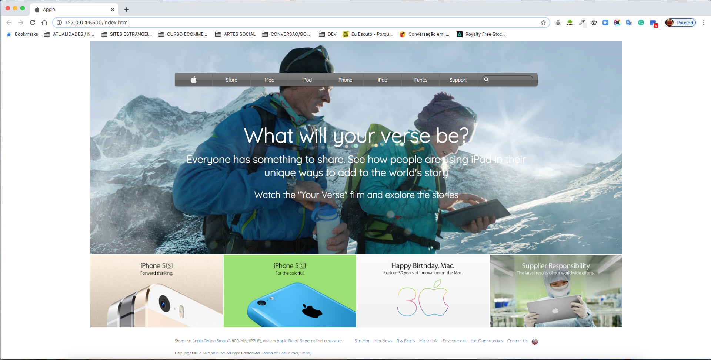

# Backgrounds-and-Gradients

This project contains a clone of Apple website, with navigation bar styled with linear graduation in the background, main content with image as a background, content below it is a grid with some products available and then comes the footer with some final links.

# Built with #
 - HTML5 
 - CSS3 
 
# Live Demo #
[Live Demo](https://rawcdn.githack.com/luciano-ilha/Backgrounds-and-Gradients/698dbbb34c0b639adb46d8f785bec9f02adffd4a/index.html)
 
# Prerequisites #
All Modern web browsers like:
- Chrome 
- Firefox
- Safari

# Author# 

👤 Luciano Ilha

 - [github](https://github.com/luciano-ilha)
 - [LinkedIn](https://www.linkedin.com/in/luciano-ilha-carbonell-188115a0/
)
 - [twitter](https://twitter.com/CarbonellIlha
) 
