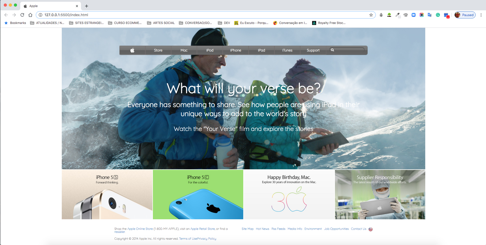

# Backgrounds-and-Gradients

>This project contains a clone of Apple website, with navigation bar styled with linear graduation in the background, main content with image as a background, content below it is a grid with some products available and then comes the footer with some final links.



# Built With #

- HTML
- CSS
- Google fonts
 
# Live Demo #
[Live Demo Link](https://rawcdn.githack.com/luciano-ilha/Backgrounds-and-Gradients/194c2929860809ef10fc56393976d198ea0fc294/index.html)
 
# Prerequisites #
All Modern web browsers like:
- Chrome 
- Firefox
- Safari


## Getting Started

To get a local copy of the repository please run the following commands on your terminal:

```
$ cd <folder>
```

```
$ git clone https://github.com/luciano-ilha/Backgrounds-and-Gradients.git
```


# Author# 

👤 Luciano Ilha

 - [github](https://github.com/luciano-ilha)
 - [LinkedIn](https://www.linkedin.com/in/luciano-ilha-carbonell-188115a0/)
 - [twitter](https://twitter.com/CarbonellIlha) 


## 🤝 Contributing

Contributions, issues and feature requests are welcome!

Feel free to check the [issues page](https://github.com/luciano-ilha/Backgrounds-and-Gradients/issues).

## Show your support

Give a ⭐️ if you like this project!

## Acknowledgments

- Project originally taken from The Odin Project
- Project inspired by Microverse Program
